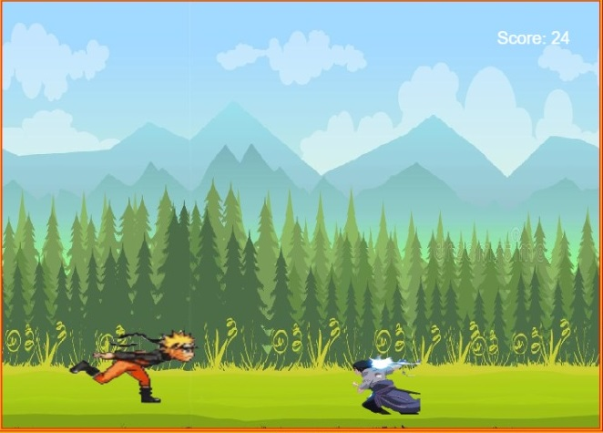

<h1>Naruto Run</h1>

Naruto Run is a game built in HTML, CSS, canvas and JavaScript.
<a href="https://samuelbatista3rios.github.io/lab-project-canvas/" target="_blank" rel="external"> 
Click HERE to play!
</a>
<button> </button>

For better experience, run this game in a browser on you nootebook or desktop PC.  Unfortunatelly this game is not compatible with mobile, yet.

<h1>Installation</h1>

Clone or download this project  
Open the index.html file in your browser  
Enjoy!

<h1>About the game</h1>
Naruto Run is an Endless Shinobi Runner Game 2D style game.  
May Hasirama and hagoromo help you, because the segundo Hokage won't! hehehe

<h1>How to Play</h1> 

Press START and then your adventure will begin.  
Use the "W" key to jump over Sasuke chidori.  
You have double jump Jutsu!  
When you die to restart: press START BUTTON again.  
Good luck and have fun!  

<h1>Contribution</h1>
This is a free software, feel free to contribute in any way you want

<a href="https://docs.google.com/presentation/d/e/2PACX-1vQUp-2YOg6H-WTthKkpAdXvwF-V-T5R6Fnw5-9oLEyXbcFSe5N_bbhPqfRLRrZSFYkGalyt-6jW-D6A/embed?slide=id.gc6f80d1ff_0_0" target="_blank" rel="external">Link to Slides</a>
